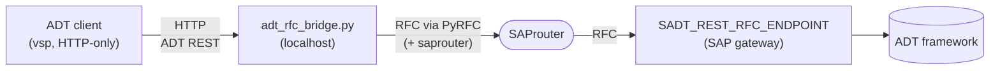

# ADT-over-RFC bridge

**Give any HTTP-only ABAP ADT client full access to a SAP system that is only
reachable over RFC / through a SAProuter. That includes the [`vsp`][vsp] MCP
server that lets Claude develop ABAP in SAP.**

Tools like [`vsp` / vibing-steampunk][vsp] let **Claude** (or another AI/MCP
client) read, search and edit ABAP in your SAP system through the **ADT REST API
over HTTP**. But some SAP systems can only be reached through a SAProuter that
allows the SAP *NI* protocol (DIAG, gateway/RFC) but **not** raw HTTP routing to
the ICM. An ADT client that speaks only HTTP then cannot connect at all, even
though Eclipse ADT can.

This bridge fixes that. It is a tiny local HTTP server that takes each ADT REST
request from your HTTP client and forwards it to SAP over **RFC**, through the
standard function module `SADT_REST_RFC_ENDPOINT`, the very same path Eclipse
ADT uses when it tunnels ADT over RFC. Nothing changes on the SAP side.



> 📖 The full story, the problem, the investigation, and why this works, is
> written up in the companion blog post: **[`blog/adt-over-rfc-bridge.md`](blog/adt-over-rfc-bridge.md)**.

---

## When you need this

Use this bridge if **all** of the following are true:

- Your ADT tooling speaks ADT **only over HTTP** (e.g. `vsp`).
- The target SAP system is reachable **only through a SAProuter**, and that
  router's `saprouttab` permits NI-native routes (gateway port, e.g. `33<nn>`)
  but **denies** raw routing to the ICM HTTP(S) port.
- You **cannot change anything on the SAP / customer side** (no new Web
  Dispatcher, no `saprouttab` edits).
- **Eclipse ADT already works** against that system (that proves the
  ADT-over-RFC path is open and you have the needed authorisations).

You do **not** need this if the system exposes HTTP(S) directly (VPN-reachable
ICM, a Web Dispatcher, or a SAProuter that permits raw routing to the ICM port).
In those cases point your ADT client straight at the HTTP(S) endpoint.

## How it works (short version)

1. Your HTTP client sends a normal ADT REST request to `http://127.0.0.1:<port>`.
2. The bridge packs the request line, headers and body into the
   `SADT_REST_REQUEST` structure and calls `SADT_REST_RFC_ENDPOINT` via
   [`pyrfc`][pyrfc]. `pyrfc` understands the `saprouter` connection parameter
   natively, so it traverses the router exactly like Eclipse/JCo.
3. SAP returns a `SADT_REST_RESPONSE`; the bridge turns it back into a normal
   HTTP response.

Two small adaptations make HTTP clients happy:

- **`HEAD` → `GET`.** The function module rejects HTTP `HEAD` (400); the bridge
  issues a `GET` and drops the body so the client still gets a valid `HEAD`.
- **Synthesised `X-CSRF-Token`.** There is no HTTP session over RFC, so SAP
  issues no CSRF token. The bridge returns a placeholder token on `fetch`
  requests. The function module is already authenticated by the RFC logon and
  does not validate CSRF, so this only satisfies the client.

A single, lock-serialised RFC connection is reused so ADT stateful sessions
(object locks etc.) survive across calls. The bridge connects **lazily**, it
performs no SAP logon until the first ADT request.

---

## Prerequisites

| Requirement | Notes |
|---|---|
| **SAP NW RFC SDK** | The C SDK `pyrfc` is built on. On Windows it usually ships **with SAP GUI** already (look for `sapnwrfc.dll`); otherwise download "SAP NWRFC SDK 7.50" from the SAP Support Portal (needs an S-user). Its `lib` folder must be on the library path (`PATH` on Windows). |
| **Python** matching the SDK architecture | The NW RFC SDK is **x86-64 only**. Use an **x64 Python** even on ARM Windows (an arm64 Python cannot load the x64 SDK). |
| **pyrfc** | `pip install pyrfc`, or grab a prebuilt wheel from the [PyRFC releases][pyrfc] if no wheel matches your Python. Must be the same architecture as the SDK and Python. |
| An ADT user with RFC authorisations | If Eclipse ADT works for your user, you already have them (`S_RFC` for the FM + the ADT resource auths). |

> **Architecture must match end to end:** x64 SDK ↔ x64 Python ↔ x64 `pyrfc`.
> This is the single most common setup mistake.

## Install

```bash
git clone https://github.com/enricoandreoli/adt-rfc-bridge.git
cd adt-rfc-bridge
pip install pyrfc      # uses the NW RFC SDK already on your PATH
```

Configure your connection:

```bash
cp .env.example .env   # Windows: copy .env.example .env
# edit .env with your RFC host, sysnr, client, user, password, saprouter, port
```

`.env` is git-ignored on purpose, it holds your credentials. Never commit it.

## Verify it works

Load your `.env` into the environment, then run the built-in self-test. It makes
a single ADT *core discovery* call all the way to SAP and prints the result:

```bash
python adt_rfc_bridge.py selftest
```

Expected output (abridged):

```
SELFTEST status: 200 OK
content-type: application/atomsvc+xml
body bytes: 4187
<?xml version="1.0" encoding="utf-8"?><app:service ...>
```

A `200` with an `atomsvc+xml` body means the whole chain, bridge → pyrfc →
SAProuter → `SADT_REST_RFC_ENDPOINT` → SAP, is working.

> ⚠️ **Account-lockout safety:** every ADT call is one RFC logon attempt. If a
> call fails with an **authentication** error, stop and fix the credentials,
> do **not** loop/retry, or SAP will lock the user. The bridge itself never
> auto-retries a failed logon.

## Run it

Start the bridge (it stays in the foreground, listening on `BRIDGE_PORT`):

```bash
python adt_rfc_bridge.py
# ADT-RFC bridge listening on http://127.0.0.1:8410 -> ... via /H/.../S/3299
```

Then point your HTTP-only ADT client at `http://127.0.0.1:<BRIDGE_PORT>`. For
`vsp` in CLI mode, set `SAP_URL`, `SAP_USER`, `SAP_PASSWORD`, `SAP_CLIENT` and
run your usual commands; e.g. a system-info / object-search call should now
return data from the system behind the router.

## Use it as an MCP server (Claude Desktop, etc.)

`vsp_launch.py` lets an MCP host (such as Claude Desktop) start everything with
one command: it auto-starts the bridge if its port is not already listening,
then hands over to the ADT client (e.g. `vsp`) inheriting the MCP stdio pipes.

Add one server entry per SAP client. Example (paths and values are illustrative):

```jsonc
{
  "mcpServers": {
    "my-rfc-client": {
      "command": "C:\\path\\to\\x64\\python.exe",
      "args": ["C:\\path\\to\\adt-rfc-bridge\\vsp_launch.py"],
      "env": {
        "BRIDGE_PORT": "8410",
        "RFC_ASHOST": "10.0.0.1",
        "RFC_SYSNR": "00",
        "RFC_CLIENT": "100",
        "RFC_USER": "YOUR_USER",
        "RFC_PASSWD": "your-password",
        "RFC_SAPROUTER": "/H/router.example.com/S/3299",

        "ADT_CLIENT": "C:\\path\\to\\vsp.exe",
        "SAP_URL": "http://127.0.0.1:8410",
        "SAP_USER": "YOUR_USER",
        "SAP_PASSWORD": "your-password",
        "SAP_CLIENT": "100"
      }
    }
  }
}
```

Because the bridge connects lazily, idle clients never touch SAP. To add another
RFC-only client, copy the entry, pick a **different** `BRIDGE_PORT` and matching
`SAP_URL`, and fill in that client's RFC settings.

## Configuration reference

| Variable | Used by | Meaning |
|---|---|---|
| `RFC_ASHOST` | bridge | Application server host as SAP sees it |
| `RFC_SYSNR` | bridge | System/instance number (default `00`) |
| `RFC_CLIENT` | bridge | Client |
| `RFC_USER` / `RFC_PASSWD` | bridge | RFC logon |
| `RFC_SAPROUTER` | bridge | Route string `/H/host/S/3299`; omit for direct access |
| `BRIDGE_PORT` | both | Local port the bridge listens on (default `8410`) |
| `SAP_URL` etc. | ADT client | Point the client at `http://127.0.0.1:<BRIDGE_PORT>` |
| `BRIDGE_PYTHON` | launcher | Python that can load the x64 SDK (default: current) |
| `BRIDGE_SCRIPT` | launcher | Path to `adt_rfc_bridge.py` |
| `ADT_CLIENT` | launcher | ADT client executable to run (default `vsp`) |

## Limitations

- Requires the NW RFC SDK and an RFC user with the ADT authorisations, i.e. a
  setup where Eclipse ADT already works.
- Reuses one serialised RFC connection: simple and lock-safe, but not tuned for
  many parallel ADT clients hammering one bridge.
- It bridges the ADT REST surface exposed by `SADT_REST_RFC_ENDPOINT`. That is
  what Eclipse uses, so day-to-day ADT development works; very exotic ICM-only
  endpoints are out of scope.

## Security notes

- `.env` and `adt_bridge.log` are git-ignored. The log can contain request URIs
  and header values, keep it local and delete it when done debugging.
- The bridge listens on `127.0.0.1` only.
- Treat your RFC credentials like any SAP password.

## Credits

- **`vsp` / vibing-steampunk**, the HTTP-only ABAP ADT MCP client this bridge
  was built to serve: [oisee/vibing-steampunk][vsp].
- **PyRFC**, the Python ↔ NW RFC SDK binding that traverses the SAProuter:
  [SAP-archive/PyRFC][pyrfc].
- **`SADT_REST_RFC_ENDPOINT`**, the standard SAP function module that dispatches
  ADT REST requests over RFC (the same one Eclipse ADT uses).

## License

[MIT](LICENSE).

---

## More tech reads

Like this kind of practical tech content? I also share technology news,
explainers and tools at **[The Clipboard][clipboard]** (theclipboard.it).
Worth a look if you enjoyed this write-up.

[vsp]: https://github.com/oisee/vibing-steampunk
[pyrfc]: https://github.com/SAP-archive/PyRFC
[clipboard]: https://theclipboard.it
